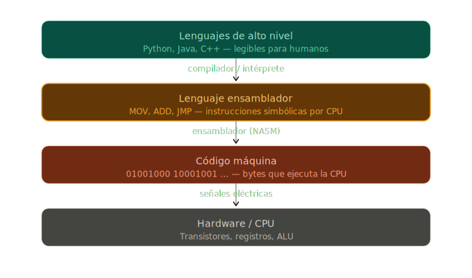
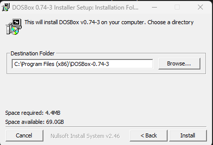
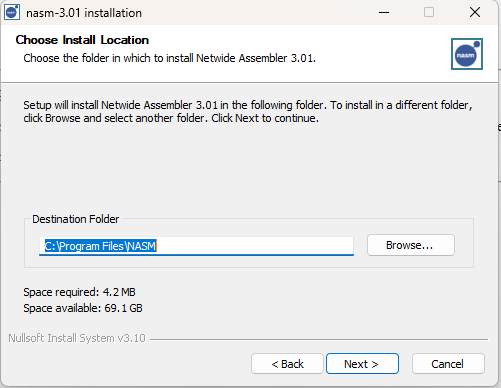
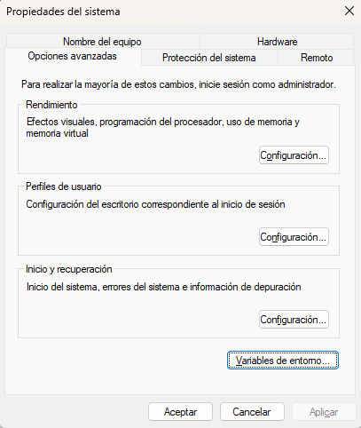
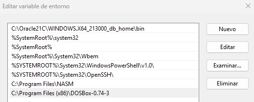
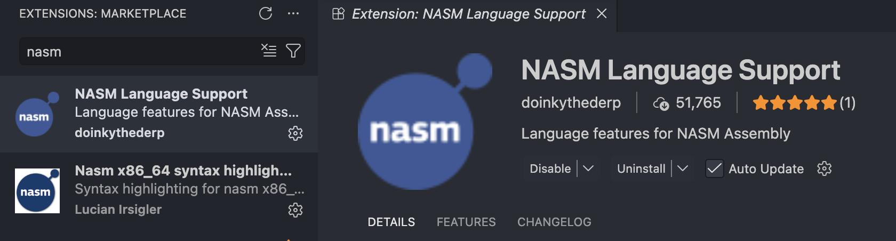
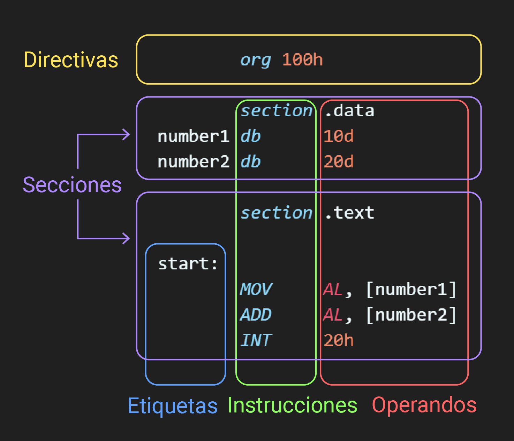

summary: Laboratorio 01 - Introducción a ensamblador y métodos de direccionamiento
id: laboratorio-01-arquitectura
categories: Ensamblador
status: Published
authors: Oscar Ayala

# Laboratorio 01: Introducción a ensamblador y modos de direccionamiento

---

## ¿Qué es el lenguaje ensamblador?
El lenguaje ensamblador es un lenguaje de bajo nivel que se comunica directamente con el hardware de la computadora. A diferencia de los lenguajes de alto nivel como Python o Java, el ensamblador se traduce directamente a código máquina, lo que permite un control preciso sobre la CPU y la memoria.



---

## ¿Qué herramientas necesitamos?
Para este laboratorio, utilizaremos las siguientes herramientas:
1. **NASM (Netwide Assembler):** Un ensamblador de código abierto que convierte el código fuente en lenguaje ensamblador a código máquina ejecutable.
2. **DOSBox:** Un emulador que recrea el entorno DOS, permitiéndonos ejecutar programas de 16 bits en sistemas operativos modernos. 


---

## ¿Por qué necesitamos estas herramientas?

Antes de instalar cualquier cosa, es importante entender el problema que cada herramienta resuelve.

### El problema: ensamblador x86 en sistemas modernos

El lenguaje ensamblador x86 de 16 bits fue diseñado para sistemas operativos como MS-DOS, que se ejecutaban en hardware específico. Las computadoras modernas, sin embargo, utilizan arquitecturas de 64 bits y sistemas operativos que no son compatibles con programas de 16 bits. Esto hace que ejecutar código ensamblador x86 directamente en una máquina moderna sea imposible sin algún tipo de emulación o virtualización.

Aquí entra **DOSBox**: es un emulador que recrea completo el entorno DOS, incluyendo una CPU virtual de 16 bits, lo que nos permite ejecutar programas escritos para ese sistema operativo sin problemas de compatibilidad.

### ¿Y NASM?

El código ensamblador que escribiremos es texto legible para humanos. Para que la CPU lo pueda ejecutar, ese texto debe convertirse a código máquina (bytes). Eso es exactamente lo que hace un ensamblador: traduce instrucciones simbólicas a binario.

### El flujo completo

```
Código .asm  →  NASM  →  Archivo .com  →  DOSBox  →  Ejecución
(texto)         (ensambla)   (binario)      (emula DOS)
```

---

## Configuración del entorno

### Windows

**1. Descargar e instalar NASM y DOSBox**

* **NASM:** Descarga el instalador `.exe` desde [nasm.us](https://www.nasm.us/pub/nasm/releasebuilds/3.01/win64/).
* **DOSBox:** Descarga e instala DOSBox desde su sitio oficial en [dosbox.com](https://sourceforge.net/projects/dosbox/files/dosbox/0.74-3/DOSBox0.74-3-win32-installer.exe/download).

> **¡Importante!** Durante el proceso de instalación de ambas herramientas, haremos una pausa en la pantalla donde se elige el directorio de destino y guardaremos ambas rutas de instalación para cada programa. Las necesitaremos en el siguiente paso.





**2. Configurar las variables de entorno**

Una vez instalados ambos programas, debemos agregar sus rutas de instalación a las variables de entorno del sistema (específicamente a la variable **PATH**) para poder ejecutarlos directamente desde cualquier terminal.

1. Abre el menú Inicio y busca "Variables de entorno". Selecciona "Editar las variables de entorno del sistema".
2. En la ventana que aparece, haz clic en el botón "Variables de entorno...".



3. Busca la variable **Path** en la lista de variables del sistema o de usuario, selecciónala y haz clic en "Editar".
4. Agrega las dos rutas que guardaste durante la instalación (la de NASM y la de DOSBox).



---

### macOS y Linux

**1. Instalar NASM y DOSBox**

Para macOS (usando Homebrew):

```bash
brew install nasm
brew install --cask dosbox
```

Para distribuciones de Linux basadas en Ubuntu/Debian:

```bash
sudo apt update
sudo apt install nasm dosbox
```

---

## Preparar entorno de trabajo

Los siguientes pasos aplican por igual sin importar el sistema operativo (Windows, macOS o Linux).

### 1. Montar la carpeta de trabajo

Para trabajar de manera cómoda, crea una carpeta para tus archivos de ensamblador. 

El comando `dosbox .` abrirá DOSBox con el directorio de tu terminal montado automáticamente como la unidad `C:`, por lo que la forma recomendada y más sencilla de abrir tu entorno es navegando desde tu terminal hasta la carpeta del proyecto que acabas de crear y ejecutando:

```bash
dosbox .
```

**Alternativa manual:** Solo en caso de que el comando anterior desde la terminal no funcione de manera automática para ti, abre la aplicación de DOSBox directamente y ejecuta los siguientes comandos para montar tu carpeta de forma manual (cambiando la ruta de ejemplo por la ubicación real de tu proyecto):

```
mount c ruta/a/tu/carpeta/ensamblador
c:
```

### 2. Instalar la extensión de NASM en VS Code

Busca **"NASM"** en el marketplace de extensiones de VS Code e instala la extensión para el resaltado de sintaxis.



---

### Sintaxis

El lenguaje ensamblador X86 tiene una estructura específica. Sus componentes principales son:

1. **Directivas:** Comandos que le indican al ensamblador cómo procesar el código. No son ejecutadas por la CPU, sino que preparan el entorno de ejecución. Pueden definir constantes, reservar espacio en memoria o controlar el proceso de ensamblaje.

2. **Secciones:** El código y los datos se organizan en secciones:
   - `section .text`: La sección principal donde se escribe el código ejecutable.
   - `section .data`: Usada para declarar variables estáticas o constantes que no cambian durante la ejecución.

3. **Etiquetas:** Identificadores que marcan puntos específicos en el código, como el inicio de una función o un bucle. Pueden ser referenciadas por instrucciones de salto y llamadas a funciones.

4. **Instrucciones:** Comandos que el procesador ejecuta directamente, como operaciones aritméticas, manejo de datos y control de flujo.

5. **Operandos:** Los valores con los que trabajan las instrucciones. Pueden ser valores inmediatos, registros o ubicaciones de memoria.



---

## Pasos para la compilación y DEBUG

**1.** Guardar el código en un archivo con extensión `.asm`.

**2.** Ensamblar el archivo con NASM ejecutando:

```bash
nasm -f bin <nombre>.asm -o <nombre>.com
```

Este comando genera un archivo ejecutable con extensión `.com`.

**3.** Abrir DOSBox desde la terminal con:

```bash
dosbox .
```

**4.** Dentro de DOSBox, cargar el programa en el depurador:

```bash
debug.exe <nombre>.com
```

---

## Comandos útiles para DEBUG

| Comando | Descripción |
|---|---|
| `r` | Muestra el estado actual de los registros de la CPU. |
| `t` | Ejecuta una sola instrucción (paso a paso). |
| `t n` | Ejecuta `n` instrucciones seguidas. |
| `g` | Ejecuta el programa completo hasta un punto de interrupción o hasta que finalice. |
| `d 200` | Muestra el contenido de la memoria en la dirección `200h`. |
| `q` | Sale del depurador y regresa al prompt de DOSBox. |

